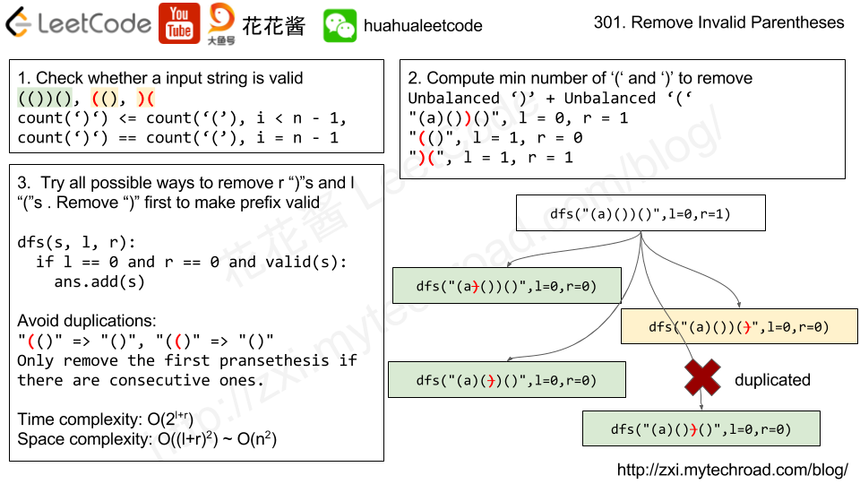

# 301. Remove Invalid Parentheses (Hard)

Remove the minimum number of invalid parentheses in order to make the input string valid. Return all possible results.

Note: The input string may contain letters other than the parentheses ( and ).

Examples:
"()())()" -> ["()()()", "(())()"]
"(a)())()" -> ["(a)()()", "(a())()"]
")(" -> [""]

## Solution
There are three challenges.
- Remove minimum parenthesis,
- The result must be valid,
- Without duplicates.

### Primitive
A linear scan of counting left and right parenthese to check if a string is valid.
`count(left) >= count(right)` except count(left) == count(right) for the last item.

### Naive Approach
The naive approach will be try removing 0, 1, 2, ... parantheses in every position. For each level, validate the string after removal, if valid, add to result *SET* and do not remove more; otherwise repeating this try removing process by removing every position in the new string, in a BFS fashion.

Since there will be many duplicates, store outputs in a Set then convert to list finally.

### Better Approach
1. Check whether an input string is valid. O(N)
2. Compute min number of '(' and ')' to remove. O(N)
3. Try all possible ways to remove: 
   - Remove ')' first to make prefix valid
   - Only remove the first if there are consecutive parentheses

#FB

#Depth-first Search #Breadth-first Search
