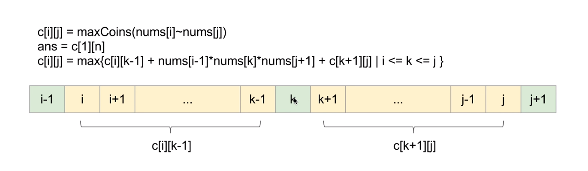

# 312. Burst Balloons (Hard)

Given n balloons, indexed from 0 to n-1. Each balloon is painted with a number on it represented by array nums. You are asked to burst all the balloons. If the you burst balloon i you will get nums[left] * nums[i] * nums[right] coins. Here left and right are adjacent indices of i. After the burst, the left and right then becomes adjacent.

Find the maximum coins you can collect by bursting the balloons wisely.

Note: 
(1) You may imagine nums[-1] = nums[n] = 1. They are not real therefore you can not burst them.
(2) 0 ≤ n ≤ 500, 0 ≤ nums[i] ≤ 100

Example:
Given [3, 1, 5, 8]
Return 167

    nums = [3,1,5,8] --> [3,5,8] -->   [3,8]   -->  [8]  --> []
   coins =  3*1*5      +  3*5*8    +  1*3*8      + 1*8*1   = 167

## Solution
The brutal force approach is to backtrace, pick a ballon, reduce the nums list, pick another one, for each permutation (bursting path), calculate the total reward, then pick the maxinum. O(N!)

Also noticed for the given example,
 - Pick 1: 3 * 1 * 5 + 3 * 5 * 8 + 3*8 + 8
 - Pick 2: 1 * 5 * 8 + 3 * 1 * 8 + 3*8 + 8

shows local maximum doesn't lead to global maximum, greedy algorithm also doesn't work here, which leads us the dynamic programming approach.

Denote the max coin rewarded from i to j by maxCoins[i][j], our goal is to find out maxCoin[1][n], we add nums[0]=1 and num[n + 1]=1 as boundary. *KEY POINT* here is for any balloons left the maxCoins does not depends on the balloons already bursted. We can do either divide and conquer top-down or dynamic programming bottom-up. See the transition formula in the picture.

#GOOGL #SNAP

#Divide and Conquer #Dynamic Programming
