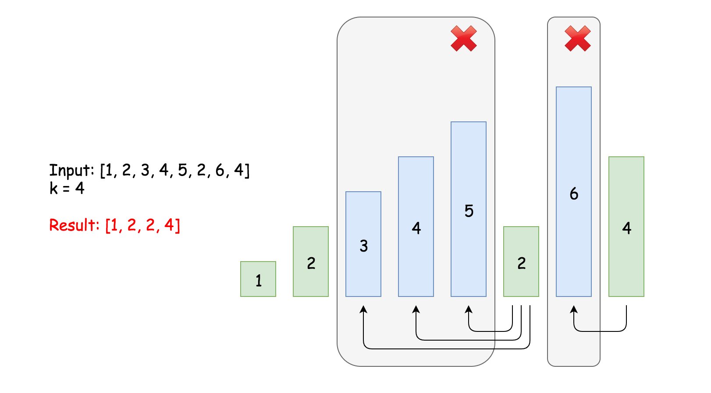

# 402. Remove K Digits (Medium)
Given a non-negative integer num represented as a string, remove k digits from the number so that the new number is the smallest possible.

Note:

The length of num is less than 10002 and will be ≥ k.
The given num does not contain any leading zero.

### Example 1:
```
Input: num = "1432219", k = 3
Output: "1219"
Explanation: Remove the three digits 4, 3, and 2 to form the new number 1219 which is the smallest.
```

### Example 2:
```
Input: num = "10200", k = 1
Output: "200"
Explanation: Remove the leading 1 and the number is 200. Note that the output must not contain leading zeroes.
```

### Example 3:
```
Input: num = "10", k = 2
Output: "0"
Explanation: Remove all the digits from the number and it is left with nothing which is 0.
```

## Solution

### Brutal Force
Enumerate all combinations k out of n digits, find out the smallest one, and there is another layer of complexity coming from comparison as we can't compare integers as they will be very big numbers.

### Greedy Algorithm
For example, if remove 1 digit from 425, from left to right. If the current digit is greater than the next one, removing it will lead to the smallest, otherwise we should keep it. After scan all the digit, if we still don't have digit to remove, e.g. 245, we just remove the last digit which is the largest digit. Repeat this local minimization process will also lead to the global minimal.



- Use a stack to store the answer which is the remaining digits we want to minimize
- Scan the original digits from input
  - pop the stack if curr is less than top and k > 0
  - push the stack
- If we still have digits to be removed after the main loop, remove them from stack until k reaches to 0
- Handle the leading zero case

#Stack #Greedy
