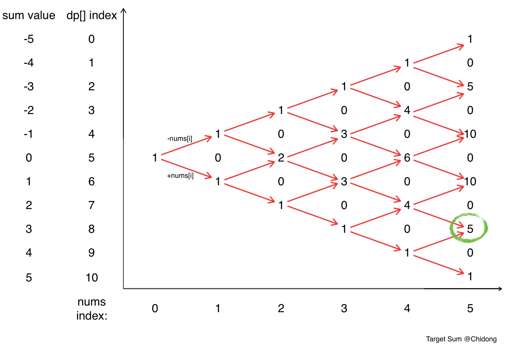

# 494. Target Sum (Medium)

You are given a list of non-negative integers, a1, a2, ..., an, and a target, S. Now you have 2 symbols + and -. For each integer, you should choose one from + and - as its new symbol.

Find out how many ways to assign symbols to make sum of integers equal to target S.

### Example 1:

Input: nums is [1, 1, 1, 1, 1], S is 3.

Output: 5

Explanation: 
```
-1+1+1+1+1 = 3
+1-1+1+1+1 = 3
+1+1-1+1+1 = 3
+1+1+1-1+1 = 3
+1+1+1+1-1 = 3
```

There are 5 ways to assign symbols to make the sum of nums be target 3.
Note:
The length of the given array is positive and will not exceed 20.
The sum of elements in the given array will not exceed 1000.
Your output answer is guaranteed to be fitted in a 32-bit integer.

## Solution
### Intuitive Approach
On each integer we have 2 choices, in total we have 2^N  way, iterate each combination to check if it contributes to the targeted sum and count.

### Branch and Bound Approach
Notices that max we can get is +sum, and min we can get is -sum, so when we do exponential search of tree we can use the bound to reduce the unnecessary recursive search. This will be slower than dynamic programming in terms of time but doesn't require extra space for DP states.

### Dynamic Programming
Similar to 0-1 Knapsack problem, 
- DP matrix `dp[i][j]` to store the number of ways solved for the i-th number and s = j, which is propagated by the sum of `dp[i-1][j-nums[i-1]]` (add nums[i]) and `dp[i-1][j+nums[i-1]]` (minus nums[i]).
- The range i is 0 to n, where n is the length of nums
- The range j is 0 to 2 * sum + 1, mapping to -sum ... -1, 0, 1 ... sum
- Return answer is `dp[n][S-sum]`



#GOOGL #FB

#Dynamic Programming #Depth-first Search
