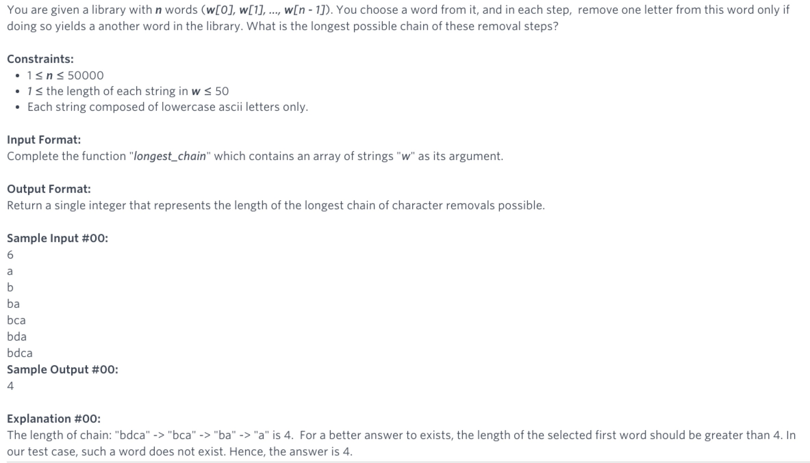

# 524. Longest Word in Dictionary through Deleting (Medium)

Given a string and a string dictionary, find the longest string in the dictionary that can be formed by deleting some characters of the given string. If there are more than one possible results, return the longest word with the smallest lexicographical order. If there is no possible result, return the empty string.

### Example 1:
```
Input:
s = "abpcplea", d = ["ale","apple","monkey","plea"]

Output: 
"apple"
```

### Example 2:
```
Input:
s = "abpcplea", d = ["a","b","c"]

Output: 
"a"
```

Note:
All the strings in the input will only contain lower-case letters.
The size of the dictionary won't exceed 1,000.
The length of all the strings in the input won't exceed 1,000.

# Longest Chain


## Solution
We will do bottom up DP approach using a hash table storing (word, chainLength)
- Sort the words in dictionary by increasing length;
- Scan the sorted the list, for each of the word;
  - Try removing one letter, increasing the chainLength if the reduced substring in the hash set;
  - Add this word into hash table with the new chainLength;

Overall complexity is O(NlogN) + O(N)

#Similar questions [#524m](../p524m/README.md) [#720e](../p720e/README.md)
