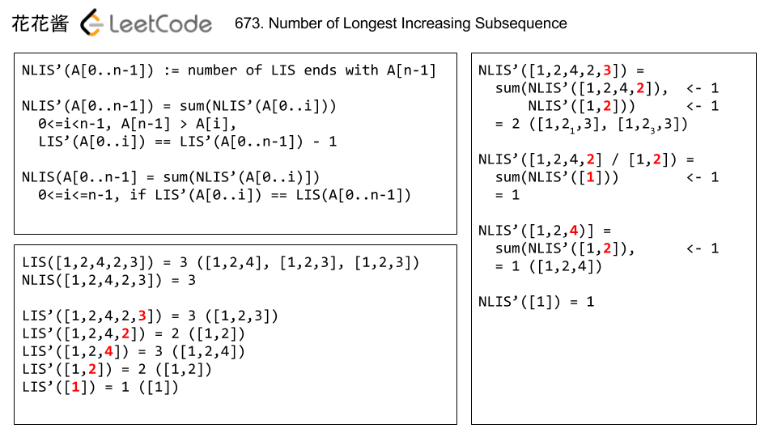

# 673. Number of Longest Increasing Subsequence (Medium)

Given an unsorted array of integers, find the number of longest increasing subsequence.

### Example 1:
Input: [1,3,5,4,7]

Output: 2

Explanation: The two longest increasing subsequence are [1, 3, 4, 7] and [1, 3, 5, 7].

### Example 2:
Input: [2,2,2,2,2]

Output: 5

Explanation: The length of longest continuous increasing subsequence is 1, and there are 5 subsequences' length is 1, so output 5.

Note: Length of the given array will be not exceed 2000 and the answer is guaranteed to be fit in 32-bit signed int.

## Solution

### Brutal Force Approach
Over all the combinations of elements of array, each element could contribute the longest increasing subsequence, like 0-1 Knapsack problem, we need to search 2^N space.

### Dynamic Programming O(N^2)
We need dynamic programming transition for length of LIS used in [#300m](../p300m/README.md) first,
```
    LIS'(A[0..n-1]) := length of LIS ends with A[n-1]
    LIS'(A[0..n-1]) = max(LIS'(A[0..i])) + 1, for all 0 <= i < n-1, s.t. A[n-1] > A[i]
    LIS(A[0..n-1]) = max(LIS'(A[0..i])), 0 <= i <= n-1
```
and also dynamic programming transition for number of LIS,
```
    NLIS'(A[0..n-1]) := number of LIS ends with A[n-1]
    NLIS'(A[0..n-1]) = sum(NLIS'(A[0..i])), for all 0 <= i < n-1, s.t. A[n-1] > A[i] and LIS'(A[0..i]) == LIS'(A[0..n-1]) - 1
    NLIS(A[0..n-1]) = sum(NLIS'(A[0..i])), for all 0 <= i <= n-1, s.t. LIS'(A[0..i]) == LIS(A[0..n-1])
```


#FB

#Array #Dynamic Programming

#Similar question [#300m](../p300m/README.md) [#673m](../p673m/README.md) [#674e](../p674e/README.md) 
