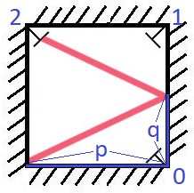
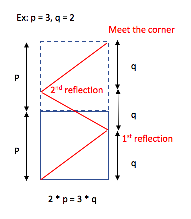

# 858. Mirror Reflection (Medium)

There is a special square room with mirrors on each of the four walls. Except for the southwest corner, there are receptors on each of the remaining corners, numbered 0, 1, and 2.

The square room has walls of length p, and a laser ray from the southwest corner first meets the east wall at a distance q from the 0th receptor.

Return the number of the receptor that the ray meets first. (It is guaranteed that the ray will meet a receptor eventually.)

### Example 1:

```
Input: p = 2, q = 1
Output: 2
Explanation: The ray meets receptor 2 the first time it gets reflected back to the left wall.
```



### Note:

1. 1 <= p <= 1000
2. 0 <= q <= p

## Solution



This problem can be transformed into finding m _ p = n _ q, where

- m = the number of room extension + 1.
- n = the number of light reflection + 1.

#Math
