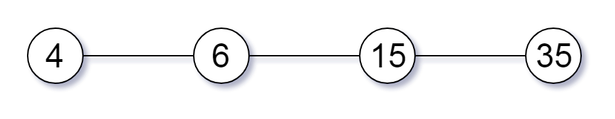
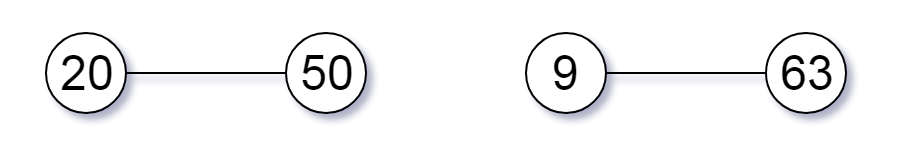
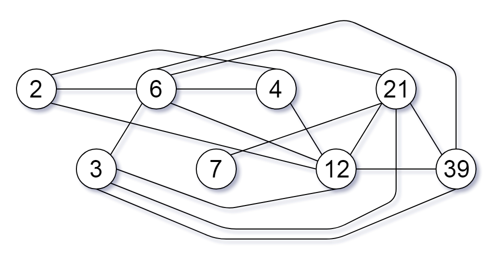

# 952. Largest Component Size by Common Factor (Hard)

You are given an integer array of unique positive integers `nums`. Consider the following graph:

- There are `nums.length` nodes, labeled `nums[0]` to `nums[nums.length - 1]`,
- There is an undirected edge between `nums[i]` and `nums[j]` if `nums[i]` and `nums[j]` share a common factor greater than 1.

Return the size of the largest connected component in the graph.

### Example 1:

```
Input: [4,6,15,35]
Output: 4
```



### Example 2:

```
Input: [20,50,9,63]
Output: 2
```



### Example 3:

```
Input: [2,3,6,7,4,12,21,39]
Output: 8
```



### Constraints:

- `1 <= nums.length <= 2 * 10^4`
- `1 <= nums[i] <= 10^5`
- All the values of `nums` are _unique_.

## Solution

- For each node, find its prime divisor set
- Append the index of node into a dict key by prime factor, for example 3, we will have

```
2: [0,2,4,5], 3:[1,2,5,6,7], 7:[3,6], 13:[7]
```

- Create a union-find (Disjoint Set) data structure
- Iterate the dict and run quick union command for each pair
- Iterate the union-find array, count the root, return the maximum

#Math #Union Find
