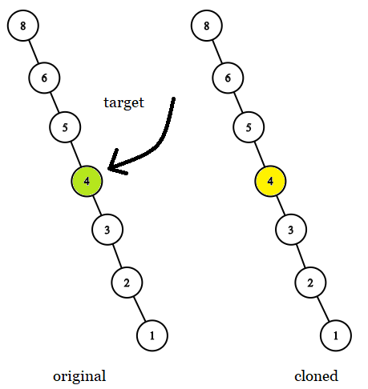

# 1379. Find a Corresponding Node of a Binary Tree in a Clone of That Tree (Medium)

Given two binary trees original and cloned and given a reference to a node target in the original tree.

The cloned tree is a _copy of_ the original tree.

Return a reference to the same node in the cloned tree.

_Note_ that you are not allowed to change any of the two trees or the target node and the answer must be a reference to a node in the cloned tree.

_Follow up_: Solve the problem if repeated values on the tree are allowed.

### Example 1:


```
Input: tree = [7,4,3,null,null,6,19], target = 3
Output: 3
Explanation: In all examples the original and cloned trees are shown. The target node is a green node from the original tree. The answer is the yellow node from the cloned tree.
```

### Example 2:


```
Input: tree = [7], target =  7
Output: 7
```

### Example 3:



```
Input: tree = [8,null,6,null,5,null,4,null,3,null,2,null,1], target = 4
Output: 4
```

### Example 4:


```
Input: tree = [1,2,3,4,5,6,7,8,9,10], target = 5
Output: 5
```

### Example 5:


```
Input: tree = [1,2,null,3], target = 2
Output: 2
```

### Constraints:

- The number of nodes in the tree is in the range [1, 10^4].
- The values of the nodes of the tree are unique.
- target node is a node from the original tree and is not null.
